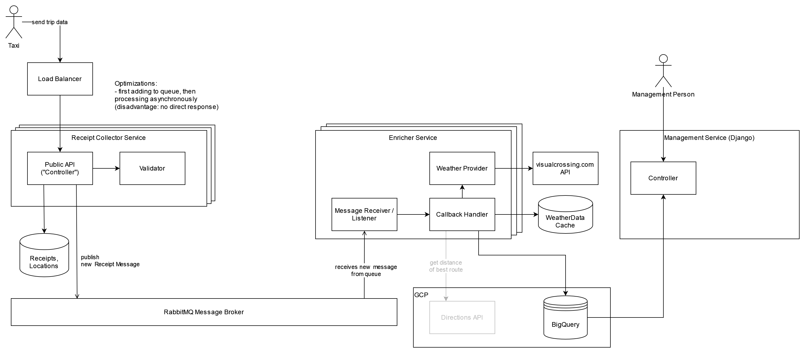

# Global Taxi Business Project

Goal: Build a platform for a globally operating taxi business. Taxi Receipts should be generated, statistics about trips can be reviewed, and it prevents fraud.

## Architecture


- Independent microservices, can be scaled
- RabbitMQ as a message broker, to shift the enrichment process
- BigQuery to process more complex queries on huge datasets
- Django app with authentication that is accessible only for admins 
- Weather data from visualcrossing.com (caching for location+date+time to reduce api calls)


## Setup

- Start 3rd party services: `docker-compose up`

### Receipt Collector
- `cd receipt_collector`
- optional: create and activate virtual environment
- `cp .env.example .env` and set your environment variables
- Run the following command to initialize the database and populate with zones
```
pip install requirements.txt
python ./backend_pre_start.py
alembic upgrade head
python ./app/initial_data.py
```
- Run application via `uvicorn app.main:app`
- To add migration, run `alembic revision --autogenerate -m "description"`

### Enricher Service
- `cd enricher`
- optional: create and activate virtual environment
- `cp .env.example .env` and set your environment variables
- Run the following command to initialize the database and populate with zones
```
pip install requirements.txt
python ./backend_pre_start.py
alembic upgrade head
python ./app/initial_data.py
```
- Run application via `python main.py`


### Management (Statistics)
- `cd management`
- optional: create and activate virtual environment
- set `GOOGLE_APPLICATION_CREDENTIALS` (filepath), `RECAPTCHA_PUBLIC_KEY` and `RECAPTCHA_PRIVATE_KEY` in `management/settings.py`
```
pip install requirements.txt
```
- run application via `python manage.py runserver 8080`


## TODOs

- [ ] Wrap services in docker files / docker-compose
- [ ] Insert to queue, before storing in db (if load is high)
- [ ] Auth for Taxis (API Key or Bearer Token for Taxis)
- [ ] Replace SQLite with db
- [ ] Use UUID's instead of int receipt id (depending on db)
- [ ] (better) documentation (openapi)
- [ ] carefully test datetime with timezones


## Further Information

### Taxi Dataset
Source: https://www1.nyc.gov/site/tlc/about/tlc-trip-record-data.page

Explanation: https://www1.nyc.gov/assets/tlc/downloads/pdf/data_dictionary_trip_records_yellow.pdf
